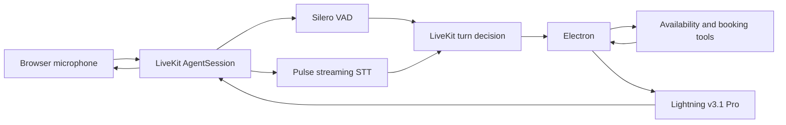

# Voice Agent Evaluation

An instrumented appointment-coordination voice agent built with Smallest AI's
speech stack and LiveKit Agents. The project emphasizes controlled evaluation
of turn finalization, Electron behavior, and Lightning delivery—not just a
working demo.

## Final MVP configuration

| Layer | Selection |
|---|---|
| Framework | LiveKit Agents over WebRTC |
| VAD | Silero defaults |
| STT | Pulse, English, 16 kHz, native endpointing, 100 ms EOU timeout |
| Turn handling | LiveKit semantic turn detector, 0.40–3.00 s endpointing delay |
| LLM | Electron, temperature 0.0, maximum 80 completion tokens |
| TTS | Lightning v3.1 Pro, `meher`, speed 1.0, 24 kHz, 0 ms buffer flush |

The assistant is Aisha from the fictional Stars Hollow clinic. It can check a
30-day deterministic mock calendar, validate a 10-digit India-local callback
number, and book a general consultation. It refuses medical advice and directs
urgent symptoms to local emergency services.



## Evaluation headline

| Stage | Scale | Decision |
|---|---:|---|
| Turn finalization | 18 fixed-audio calls across R1–R3 | R2 reduced fragmentation versus R1 without R3's large latency penalty |
| Pulse WER | 18 fixed-audio transcripts, 222 reference words | 2.70% normalized WER; descriptive sanity check, not a configuration selector |
| Electron | 72 scripted requests | Temperature 0.0 and 80 tokens; all tested settings passed 18/18 |
| Lightning | 24 fixed-phrase syntheses + listening | Speed 1.0 and buffer 0 ms |
| Final acceptance | One human end-to-end LiveKit call | Correct availability, 6/9/10-digit handling and booking; zero application errors |

Read [the complete evaluation narrative](docs/evaluation-summary.md) for the
hypotheses, controls, results, limitations, and why each setting was selected.

## Setup

Prerequisites:

- Python 3.11–3.13
- [`uv`](https://docs.astral.sh/uv/)
- A Smallest AI API key with Pulse, Electron, and Lightning access
- A LiveKit Cloud project

Install and configure:

```powershell
uv sync --python 3.13
Copy-Item .env.example .env
```

Fill the four credentials in `.env`, then download LiveKit model assets:

```powershell
uv run python -m src.agent download-files
```

Start the worker:

```powershell
uv run python -m src.agent dev
```

Wait for `registered worker`, then connect through the LiveKit Agent Playground.
The worker reads `.env` only when it starts, so restart it after changing
configuration. Stop it with `Ctrl+C`.

## Evidence and reports

Every completed call writes:

- a machine-readable event stream under `results/jsonl/`;
- a human-readable Markdown report under `results/reports/`.

Reports contain the exact system configuration, transcript and committed-turn
counts, conversation, tool inputs/outputs, errors, and mean/p50/p95 timing
metrics. Structured authentication and phone-number fields are redacted before
writing.

These per-call files are intentionally ignored by Git because they can contain
spoken personal information. Sanitized aggregate results live under
`results/evaluations/` and are included in the repository.

## Reproduce the evaluations

Electron parameter suite:

```powershell
uv run python -m scripts.evaluate_electron
```

Lightning timing and listening suite:

```powershell
uv run python -u -m scripts.evaluate_lightning --repetitions 1
```

Fixed-audio LiveKit replay:

```powershell
uv run python scripts/replay_livekit_audio.py `
  tests/audio/processed/clean-request.wav `
  tests/audio/processed/hesitation-request.wav `
  tests/audio/processed/details-request.wav `
  --run-label recorded-r1
```

Derive normalized Pulse WER from the retained fixed-audio logs:

```powershell
uv run python -m scripts.evaluate_pulse_wer
```

The original human recordings are excluded from Git for privacy. See
[`tests/audio/README.md`](tests/audio/README.md) to create replacement fixtures.

## Tests

```powershell
uv run python -m pytest -q
uv run python -m ruff check .
```

Tests that inspect private audio fixtures skip cleanly when those local files
are absent.

## Repository map

```text
src/                    Live agent, configuration, tools, logging, reports
scripts/                Electron, Lightning, and fixed-audio evaluation runners
tests/                  Unit tests plus the private-audio fixture manifest
docs/                   Evaluation plan, scripts, parameter sweep, final summary
results/evaluations/    Sanitized aggregate evidence and listening montages
results/jsonl/          Local raw call events; ignored by Git
results/reports/        Local per-call readable reports; ignored by Git
```

## Known limitations

- The mock scheduler is in-memory and resets whenever the worker restarts.
- A later human call exercised live barge-in successfully, but an obsolete
  availability request could still finish speaking after the caller corrected
  the date. Production work should cancel or suppress stale tool results.
- Phone validation is deliberately scoped to 10-digit India-local numbers; it
  does not implement international numbering plans.
- One final-call interruption was most consistent with speaker-to-microphone
  echo: Pulse captured words Aisha had just spoken as user input. The logger
  does not capture WebRTC packet-loss or jitter statistics for attribution.
- Two fixed-audio repetitions per turn configuration support a bounded MVP
  decision, not a population-level reliability claim.
- Explicit Pulse force-finalization and telephone integration are documented
  follow-ups rather than MVP dependencies.
