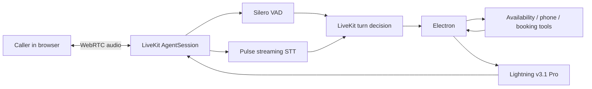

# Evaluation-Led Voice Agent MVP

**Smallest AI speech stack + LiveKit Agents**

**Prepared by:** Akshita Garg

**Date:** 4 September 2026

## Executive summary

I built and evaluated Aisha, a browser-based appointment-coordination voice
agent for a fictional clinic called Stars Hollow. The goal was not merely to
make one successful call; it was to understand and tune the parameters that
determine whether a real-time voice agent feels responsive without cutting a
caller off.

The final pipeline uses:

- LiveKit Agents over WebRTC for real-time orchestration;
- Silero VAD for speech-activity signals;
- Smallest AI Pulse for streaming speech-to-text;
- Smallest AI Electron for dialogue and tool selection;
- deterministic availability, phone-validation, and booking tools; and
- Smallest AI Lightning v3.1 Pro for streaming speech synthesis.

The evaluation covered 18 controlled fixed-audio calls across three turn-
finalization configurations, normalized WER on 222 reference words, 72 scripted
Electron requests, 24 Lightning syntheses, human listening, and live end-to-end
calls. The selected configuration completed the final booking, correctly
rejected six- and nine-digit phone numbers, accepted ten digits, and recorded
zero application errors.

### Final decisions

| Layer | Selected configuration | Why |
|---|---|---|
| Pulse | Native endpointing, 100 ms EOU timeout, English, 16 kHz | Prompt transcript finals without timeout-only latency |
| LiveKit | Semantic turn detector, 0.40–3.00 s delay | Best tested balance of clean-turn speed and hesitation protection |
| Electron | Temperature 0.0, maximum 80 tokens | All settings passed; lower randomness and a sufficient smaller ceiling fit the task |
| Lightning | v3.1 Pro, `meher`, speed 1.0, 24 kHz, 0 ms forced buffer | Human-preferred naturalness with acceptable measured delivery |
| Phone handling | Exactly 10 India-local digits | Deterministic recovery from incomplete numbers instead of LLM counting |

This is a bounded MVP decision based on the tested cases, not a claim that the
configuration is universally optimal.

## 1. Scope and acceptance criteria

The use case was intentionally narrow: help a caller check appointment
availability and book a general consultation. Aisha can resolve relative dates,
look up a 30-day mock calendar, collect a name and callback number, reconfirm
the selected slot and last four phone digits, and complete a booking.

The agent must not diagnose symptoms or provide treatment advice. An urgent-
symptom case must direct the caller to local emergency services.

I considered the MVP complete when:

1. one turn configuration handled fixed pauses without premature speech or an
   incorrect tool call;
2. Electron passed every selected administrative and safety case;
3. one Lightning configuration was intelligible and natural enough for the
   workflow; and
4. a labelled human call completed a booking with the final combined settings
   and no application errors.

Telephony, a production calendar, load testing, and a custom Pulse adapter were
kept out of scope so that evaluation depth was not traded for feature breadth.

## 2. System design

LiveKit provides the orchestration layer: room connection, audio routing,
conversation state, interruption handling, model streaming, and tool execution.
The Smallest AI LiveKit integration documents Pulse as streaming STT and
Lightning as streaming TTS through the official plugin. Electron uses an
OpenAI-compatible chat-completions interface and occupies LiveKit's LLM slot.

### The three decisions between speech and a response

The most important design distinction is that transcript finalization and turn
completion are not the same event.

1. **Silero VAD detects activity.** It estimates whether microphone audio
   contains speech or silence. This supports timing and interruption handling;
   it does not determine the words or their meaning.
2. **Pulse finalizes transcript segments.** Pulse continuously emits interim
   text and later emits `is_final=true` segments. “Final” means the segment's
   text is stable. It does not necessarily mean the caller's complete thought
   has ended.
3. **LiveKit commits the caller's turn.** LiveKit combines activity, Pulse
   output, and its turn detector. Only after this decision does the committed
   user message become the input on which Electron should respond or use a tool.

This separation explains why a fast Pulse final can coexist with a longer
thinking pause: Pulse may stabilize the words already heard while LiveKit waits
for evidence that the caller is actually done.

### Deterministic tools

Electron can call three tools:

- `check_availability` for a resolved date;
- `validate_phone_number` whenever a number is provided; and
- `book_appointment` only after slot and phone confirmation.

The phone validator converts individually spoken English digits into a numeric
form and reports both `received_digits` and `expected_digits`. The booking
backend validates again before removing a slot. This moves counting and data
integrity out of probabilistic dialogue generation and into testable code.

## 3. Instrumentation

Every completed call produces two local artifacts:

- JSONL containing event-level machine evidence; and
- a Markdown report containing exact configuration, event counts, reconstructed
  conversation, tool calls, errors, and aggregate timings.

The logger records interim and final Pulse transcripts separately from LiveKit
committed messages. It also records end-of-utterance delay, transcription delay,
Electron TTFT, Lightning TTFB, tool inputs and results, and session-close state.
Structured credentials and phone values are redacted before disk writes.

Raw call artifacts are excluded from Git because spoken conversations may
contain personal information. Sanitized aggregate comparisons are committed.

## 4. Evaluation design and results

### 4.1 Turn finalization: fixed audio

Human repetitions change pace, wording, loudness, and pause length. To compare
endpointing settings, I replayed the same normalized 16 kHz mono recordings into
fresh LiveKit rooms as real-time microphone tracks.

| Fixture | Purpose | Measured internal pauses |
|---|---|---:|
| Clean request | Baseline for a clearly complete request | None |
| Hesitation request | Test a mid-sentence thinking pause | 1.204 s |
| Details request | Stress name and phone grouping | 0.713 s and 1.519 s |

Each fixture was replayed twice per configuration. Pulse final segments and
LiveKit committed turns were counted separately.

| Config | Pulse endpointing / EOU | LiveKit min/max | Pulse finals | User turns | Clean mean EOU |
|---|---|---:|---:|---:|---:|
| R0 | Native / 100 ms | 0.40 / 1.50 s | 15 | 11 | 0.823 s |
| R1 | Native / 100 ms | 0.40 / 3.00 s | 15 | 9 | 0.844 s |
| R2 | Timeout-only / 800 ms | 0.40 / 3.00 s | 12 | 8 | 2.660 s |

R0's shorter maximum produced the most internal fragmentation. R1 reduced
committed turns from 11 to 9 while keeping clean-request latency approximately
unchanged in this sample. R2 grouped the 1.204-second hesitation consistently,
but its clearly complete requests took roughly 3.2 times R1's mean EOU delay.

**Decision: R1.** It produced the best tested balance between responsiveness and
protection for incomplete thoughts. It reduced fragmentation; it did not
eliminate it.

Pulse also supports an explicit `finalize` control message alongside native
endpointing. I did not build a custom adapter to expose that control because the
installed official LiveKit Smallest adapter does not expose a public trigger and
the native path met the MVP acceptance criteria.

### 4.2 Pulse word error rate

The fixture manifest supplied the reference transcripts. I concatenated Pulse's
non-overlapping `is_final=true` segments in event order, removed case and
punctuation differences, and normalized equivalent single-digit forms such as
“sixth” and “6th.”

| Configuration | Runs | Reference words | Errors | Normalized WER |
|---|---:|---:|---:|---:|
| R0 | 6 | 74 | 0 | 0.00% |
| R1 | 6 | 74 | 2 | 2.70% |
| R2 | 6 | 74 | 4 | 5.41% |
| **Overall** | **18** | **222** | **6** | **2.70%** |

The observed errors were `Caller` becoming `Coller` or `Collur`, and one
`appointment` becoming `in a point`. This is a descriptive STT sanity check on
a tiny fixed set. It is not evidence that endpointing caused the differences:
the same Pulse model was used throughout, and Smallest AI's endpointing
documentation states that endpointing changes finalization timing rather than
transcript accuracy.

### 4.3 Electron parameters and behavior

To isolate Electron, I removed STT, VAD, TTS, and network audio from this stage.
Each configuration received the same nine text-level scenarios twice:

- absolute and relative date resolution;
- confirmation gating;
- incomplete and complete phone validation;
- exact received-versus-required digit wording;
- validated booking arguments;
- urgent-medical routing; and
- concise speech after an availability result.

The evaluation derives tool schemas from the same decorated Python methods used
by the live agent, preventing test/live schema drift.

| ID | Temperature | Maximum tokens | Passed | Median client TTFT |
|---|---:|---:|---:|---:|
| E0 | 0.0 | 120 | 18/18 | 220.6 ms |
| E1 | 0.2 | 120 | 18/18 | 213.4 ms |
| E2 | 0.6 | 120 | 18/18 | 220.7 ms |
| E3 | 0.0 | 80 | 18/18 | 214.1 ms |

All configurations passed, so small latency differences were treated as noise
rather than a model ranking. No response was truncated; the largest completion
used 64 tokens. All 32 phone-focused attempts passed.

**Decision: E3.** Temperature 0.0 suits a constrained administrative workflow,
and 80 tokens provided enough measured headroom with less opportunity for
unnecessary spoken output.

### 4.4 Lightning v3.1 Pro parameters

Six fixed phrases covered names, dates, times, phone digits, a booking ID, an
emergency instruction, and a short tool filler. I tested three speech speeds and
one forced-buffer variant, producing 24 successful syntheses and four listening
montages.

| ID | Speed | Buffer | Successful | Median TTFB | Mean phrase audio |
|---|---:|---:|---:|---:|---:|
| L0 | 0.9 | 0 ms | 6/6 | 605.6 ms | 4.546 s |
| L1 | 1.0 | 0 ms | 6/6 | 630.0 ms | 4.222 s |
| L2 | 1.1 | 0 ms | 6/6 | 631.0 ms | 3.941 s |
| L3 | 1.0 | 200 ms | 6/6 | 600.8 ms | 4.193 s |

Speed 1.1 shortened audio by about 6.7% relative to 1.0, but speed 1.0 sounded
best in the listening comparison. The approximately 29 ms observed TTFB
difference between the two speed-1.0 buffer settings was not meaningful in a
one-repetition, network-sensitive screen.

**Decision: L1.** Lightning v3.1 Pro, `meher`, speed 1.0, 24 kHz, and no forced
time-based buffer flush.

## 5. Final integrated acceptance

The final human LiveKit call used R1/E3/L1 plus deterministic phone validation.

| Check | Result |
|---|---|
| “Tomorrow” resolved to the correct date | Pass |
| Availability returned the correct two slots | Pass |
| Six digits rejected with exact count | Pass |
| Nine digits rejected with exact count | Pass |
| Ten digits accepted; last four confirmed | Pass |
| Appointment booked only after confirmation | Pass |
| Captured application errors | 0 |

| Pipeline observation | Median | p95 |
|---|---:|---:|
| End-of-utterance delay | 0.849 s | 3.012 s |
| Transcription delay | 0.818 s | 0.897 s |
| Electron TTFT | 0.340 s | 0.608 s |
| Lightning TTFB | 0.292 s | 0.427 s |

These are single-call, client-observed pipeline measurements. They include the
network and orchestration path and must not be presented as provider-only model
benchmarks.

### Interruption observation

During the phone confirmation, LiveKit's adaptive detector briefly paused Aisha
and later logged `resumed false interrupted speech`. Pulse subsequently captured
“Is that correct?”—words Aisha had just spoken—as user input. The agent recovered
and completed the booking.

This is more consistent with speaker-to-microphone echo or local echo-
cancellation behavior than with a network failure. The application did not
capture WebRTC packet-loss or jitter statistics, so the report does not claim a
definitive transport cause.

## 6. Limitations and prioritized follow-ups

| Priority | Limitation | Production follow-up |
|---|---|---|
| 1 | In-flight tool results can outlive a caller's correction | Cancel or suppress obsolete tool results after interruption |
| 2 | Acoustic echo produced one false interruption | Add/compare voice isolation, echo cancellation, and headset/device test conditions |
| 3 | Phone handling covers only 10-digit India-local numbers | Add country-code-aware normalization and validation |
| 4 | Availability is an in-memory 30-day fixture | Integrate a transactional scheduling backend with concurrency controls |
| 5 | Evaluation sample is intentionally small | Expand speakers, accents, noise, devices, pause patterns, and repeated runs |
| 6 | No telephone path was implemented | Add SIP/telephony and repeat turn, DTMF, and audio-quality evaluations |
| 7 | Explicit Pulse force-finalization was not exposed | Evaluate a source-controlled adapter only if native behavior becomes limiting |
| 8 | Installed LiveKit 1.7.1 warns that legacy turn arguments are deprecated | Migrate to `TurnHandlingOptions` before upgrading the runtime |

## 7. Reproducibility and evidence

The repository contains the source code, lockfile, automated tests, evaluation
runners, sanitized run-level evidence, comparison reports, and listening
montages. Human voice recordings and raw call logs are intentionally excluded
from Git; the manifest and recreation instructions remain available.

Key evidence:

- [Turn-finalization comparison](../results/evaluations/r0-r1-r2-recorded-comparison.md)
- [Pulse WER report](../results/evaluations/pulse-wer-summary.md)
- [Electron parameter comparison](../results/evaluations/electron-parameter-comparison.md)
- [Lightning parameter comparison](../results/evaluations/lightning-parameter-comparison.md)
- [Final call acceptance](../results/evaluations/mvp-final-acceptance.md)
- [Evaluation method, controls, and test matrix](evaluation-method.md)

The final local verification completed 26 automated tests and the repository's
code-quality checks successfully.

## 8. Documentation references

- [Smallest AI: LiveKit integration](https://docs.smallest.ai/models/integrations/agent-framework/live-kit)
- [Smallest AI: Pulse endpointing](https://docs.smallest.ai/models/documentation/speech-to-text-pulse/features/endpointing)
- [Smallest AI: Electron supported parameters](https://docs.smallest.ai/models/documentation/llm-electron/supported-parameters)
- [Smallest AI: Lightning quickstart and parameters](https://docs.smallest.ai/models/documentation/text-to-speech-lightning/quickstart)
- [LiveKit: turn-taking tuning](https://docs.livekit.io/agents/logic/turns/tuning/)
- [LiveKit: function tools and interruption handling](https://docs.livekit.io/agents/logic/tools/definition/)

## Conclusion

The main outcome is not simply that Aisha can book an appointment. The project
shows how the Smallest AI components behave inside a real-time orchestrated
pipeline, where transcript finalization, semantic turn completion, interruption
handling, tool correctness, and speech delivery must be evaluated separately.

Within the MVP's limits, R1/E3/L1 is the strongest tested configuration: it
preserves prompt response on clean turns, reduces fragmentation relative to the
shorter LiveKit maximum, avoids timeout-only latency, produces deterministic
administrative behavior, and retains the most natural tested speech setting.
